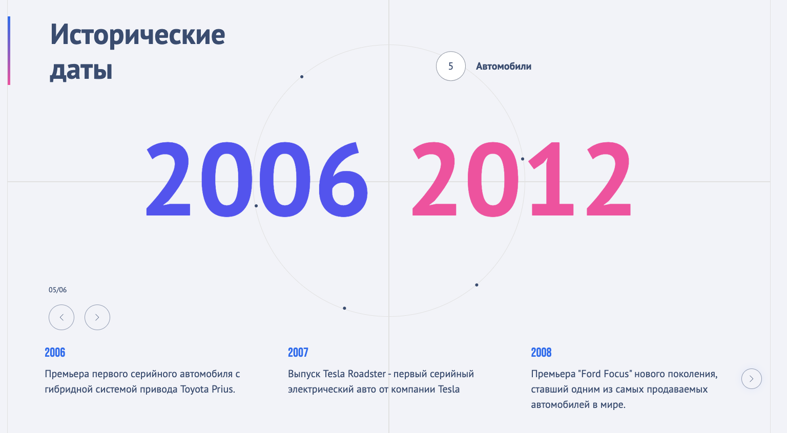

# О проекте
Визуализация временных отрезков и их событий. 
Радиальный слайдер отражает массив периодов по годам.
Горизонтальный слайдер отображает события выбранного периода времени.

Работает на `gsap` и `swiper`.

# Запуск проекта
0. Убедиться, что вы находитесь в ветке `main`
1. Установить зависимости `yarn install`
2. Запустить dev-сервер `yarn start`
3. Перейти по адресу `http://localhost:3000/`
